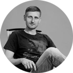

# Dziahonski Artsiom


## Contacts

 [degonski.art@gmail.com](mailto:degonski.art@gmail.com)\
 [tyronmaster](https://github.com/tyronmaster)\
 [tyronmaster](https://github.com/tyronmaster)\
 [+375299499201](tel:+375299499201)\


&nbsp;

## About
   Well, for the last 15 years I've made an advertising and promotion companies for the biggest furiture (and other items for home) retailer in Belarus. During this period company grows from 5 own stores to retail network with more than 250 stores and became a leader of non-food retailers. Plan of sales increases monthly and sellers performed it with my department help.\
   In my work I'll always try to stay correct and respectfully goes with colleagues, explain difficult moments to employees and try to find solving together.\
   For now I'd like to increase my knowledges in the new sphere of my interests - programming. I'd like to study JS to use it in real projects. Seems to me, it helps to make something usefull for the people. And it'll be interesting for me to combine my "advertising" knowledges with web-technologies. \
   So, let's keep moving!

&nbsp;

## Skills

* Adobe: Photoshop, Illustrator, InDesign, After Effect
* Corel Draw
* HTML, CSS
* JS (basic)
* Delphi
* C#  

&nbsp;

## :godmode: Code Samples

[get3dviz.com](https://get3dviz.com/)

```C#
namespace HelloWorld
{
    class Hello {         
        static void Main(string[] args)
        {
            System.Console.WriteLine("Hello World!");
        }
    }
}
```
&nbsp;

## Job

  04/2005 - 08/2006 "Laguna" furniture factory - advertising specialist, designer\
  09/2006 - 09/2013 "Laguna" furniture factory - head of advertising department\
  10/2013 - till now AMI trading house - head of advertising department\
  10/2013 - till now "Laguna" furniture factory - vice head of advertising department\
  2014 - 2017 - freelancer projects - design for Moscow pawnshops\
  2015-2016 - freelancer for https://www.youtube.com/c/AmiMebelby/videos channel\
  2015 - 2019 - freelancer projects - small web-master projects like HTML-pages layout, correcting CSS, .htaccess and the same\
  2016 - freelancer project - application for printing prices [add actual link](https://github.com/tyronmaster/rsschool-cv/edit/gh-pages/cv.md)

&nbsp;


## Education

* 2000-2004 BSTU - _mechanical engineering faculty_
* 2004-2005 BarSU - _economics & management_
* 2006-2007 Dom Polski - _polish language courses_
* 2012-2015 BSUIR - _computer science & programming technologies_
* 2021 - SEO-shaolin courses - _SEO for USA companies_

&nbsp;

## Languages
* Russian, Belarusian - native
* English - B1
* Polish - B1